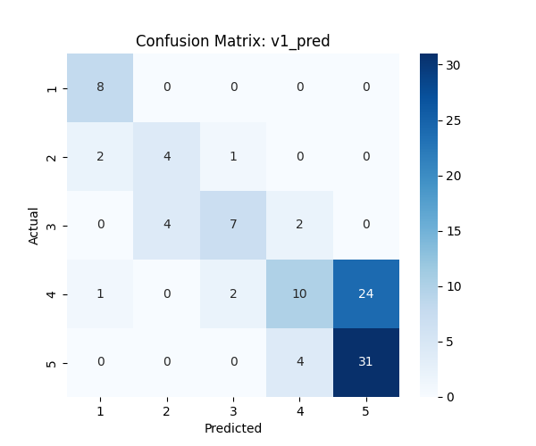
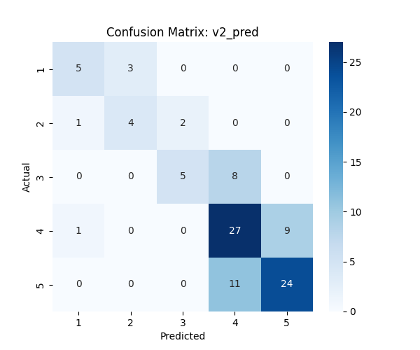
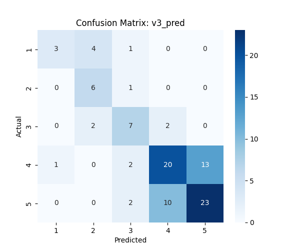

# Evaluation of 3 prompts

## Prompt 1: Baseline prompt(v1)
**Reason for trying this prompt:**  
This will be a direct prompt stating what exactly the task is and not much more information on how to do it.  
This will be used to compare with the rest of the prompts. 

```prompt
Classify the following Yelp review into a rating of 1 to 5 stars.  
Output JSON: {{"predicted_stars": int, "explanation": str}}  
Review: {review}  
```

## Prompt 2: Strict prompt(v2)
**Reason for trying this prompt:**  
With the baseline prompt I realised many 4's were considered as 5's. After looking at the dataset I realised the 4 star reviews mostly have some negative point in the text. So this prompt was caliberated to minimise that error.

```prompt
Classify this Yelp review from 1-5 stars.
Critical rule: If the review contains ANY complaint, criticism, or suggestion for improvement, it cannot be 5 stars (maximum 4 stars).
5 stars = Only pure praise, no negatives whatsoever
4 stars = Mostly positive BUT mentions at least one flaw, limitation, or wish
Output JSON: {{"predicted_stars": int, "explanation": str}}
Review: {review}
```

## Prompt 3: Chain of Thought prompt(v3)
**Reason for trying this prompt:**  
Trying out a new approach now which is applied with many LLM's for coding tasks is chain-of-thought. Making the LLM

```prompt
Analyze this Yelp review step-by-step:
1. List ALL positive aspects mentioned (food quality, service, atmosphere, value, etc.)
2. List ALL negative aspects, complaints, or limitations mentioned (even minor ones like "wish they had X", "a bit crowded", "long wait", "limited options")
3. Check for qualifying language: "but", "however", "except", "only issue", "I wish"
Decision logic:
- ANY negatives found in step 2 or 3? -> Maximum 4 stars
- Only positives with enthusiastic tone? -> 5 stars
- Mixed or neutral tone? -> 3 stars
- Negative description and tone -> 2 star or below
Output JSON: {{"predicted_stars": int, "explanation": str}}
Review: {review}
```

# Evaluation criterias
- Accuracy: As it was asked in the assignment
- Weighted F1 score: Since there is class imbalance an f1 score is more better in undersatanding how well the prompt is doing
- Mean Absolute Error: To see on average how far are the predictions from acutal values(in 'star' unit)

# Data and model summary
- Sample dataset size: 100 rows (did not take 200 becuase of API rate limits)  
Proportion of each class were kept similar to the original dataset
- model_id: llama-3.1-8b-instant
- API provider: Groq

# Evaluation metrics

### 1. Baseline prompt

- Accuracy: 60%
- F1 score-weigted: 0.56
- MAE: 0.42
- JSON validity: 100%

- Confusion matrix  
  

### 2. Strict prompt

- Accuracy: 65%
- F1 score-weigted: 0.65
- MAE: 0.37
- JSON validity: 100%

- Confusion matrix  
  

- **This has improved the result**  
Many 4's which were wrongly classified as 5 now have been classified correctly. Increasing the accuracy by 5%.

### 3. CoT prompt

- Accuracy: 61%
- F1 score-weigted: 0.61
- MAE: 0.44
- JSON validity: 100%

- Confusion matrix  
  

- **The result was better than the baseline**  
The f1 score increased a lot that means it is working much better on this imbalanced dataset.

# Comparison table

| Metric              | v1   | v2   | v3   |
|---------------------|------|------|------|
| Accuracy            | 60%  | 65%  | 61%  |
| F1 score (weighted) | 0.56 | 0.65 | 0.61 |
| MAE                 | 0.42 | 0.37 | 0.44 |
| JSON validity       | 100% | 100% | 100% |

# JSON validity
- I got 100% json validity on all prompts becuase of the new response_format attribute in the chat completions endpoint of the API.  
`response_format={"type": "json_object"}`

# Summary

- Overall, V2 is the best one with highest scores in all metrics.
- V2 was able to classify most of the 4's and 5's which increased its accuracy as they are the majority. 
- The CoT prompt(v3) did better than the baseline prompt. The F1 score increased, that means this would perform a lot better on an imbalanced dataset like this than the baseline prompt. 
- Baseline prompt gave the fastest results and was much better than I expected.
